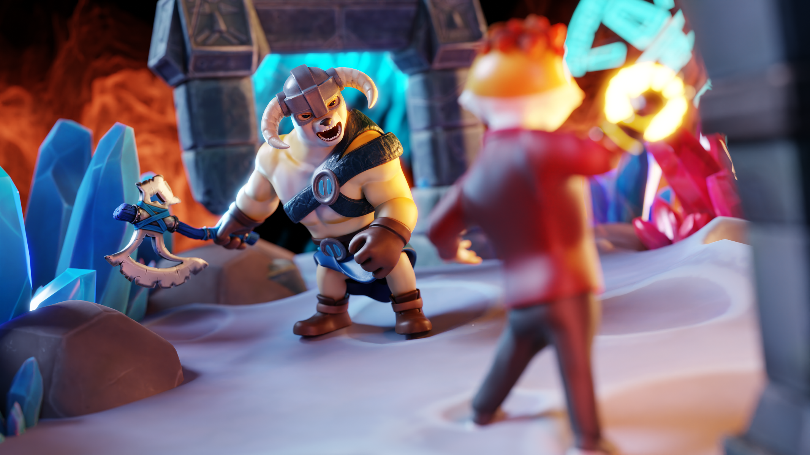

# Clash Of Memes

<figure><figcaption></figcaption></figure>

### Gameplay Overview:

Clash of Memes offers an immersive and engaging gameplay experience that combines elements of strategy, competition, and collectability. Players enter a vibrant digital world where memes come to life, battling it out for supremacy and rewards. Here's an overview of the gameplay mechanics:

**a) Memecoin Battles:** Players assemble their meme armies, each consisting of unique NFTs representing popular memes and characters. These NFTs possess varying attributes, abilities, and rarity levels that directly impact gameplay. Players strategically deploy their meme army to engage in memecoin battles, where they compete against other players or AI-controlled opponents.

<figure><figcaption></figcaption></figure>

\

**b) Strategic Deployment:** Successful gameplay in Clash of Memes requires careful strategic planning. Players must analyze their opponents' meme armies, assess their strengths and weaknesses, and formulate effective battle strategies. Each meme NFT possesses unique abilities, synergies, and counters, allowing players to create diverse and powerful combinations for battle.

**c) Battle Outcome and Rewards:** The outcome of memecoin battles determines the rewards earned by players. Victorious players are rewarded with additional, experience points (XP), and other valuable in-game resources. These rewards can be used to enhance their meme army, unlock rare NFTs, or acquire limited-edition items through the in-game marketplace.

**d) Progression and Leaderboards:** As players engage in battles, they earn experience points, level up, and unlock new features and gameplay modes. Clash of Memes incorporates a comprehensive leaderboard system that tracks players' performance, allowing them to compete for the top rankings and gain recognition within the community. Weekly and seasonal tournaments offer $PMC rewards, further amplifying the competitive spirit of the game.

**e) NFT Customization and Upgrades:** Clash of Memes offers extensive customization options for NFTs, allowing players to personalize their meme army and express their unique style. Players can customize the appearance, attributes, and abilities of their NFTs using in-game resources and upgrades. This customization feature not only enhances the visual appeal but also provides strategic advantages in battles.\

<figure><figcaption></figcaption></figure>

**f) Community-driven Events and Collaborations:** To foster a thriving and dynamic community, Clash of Memes hosts regular events, competitions, and collaborations. These community-driven activities encourage player interaction, creativity, and engagement. Collaborations with renowned meme creators, artists, and influencers bring exclusive NFTs and content into the game, offering players exciting opportunities to acquire rare and highly sought-after collectibles.

\

###
