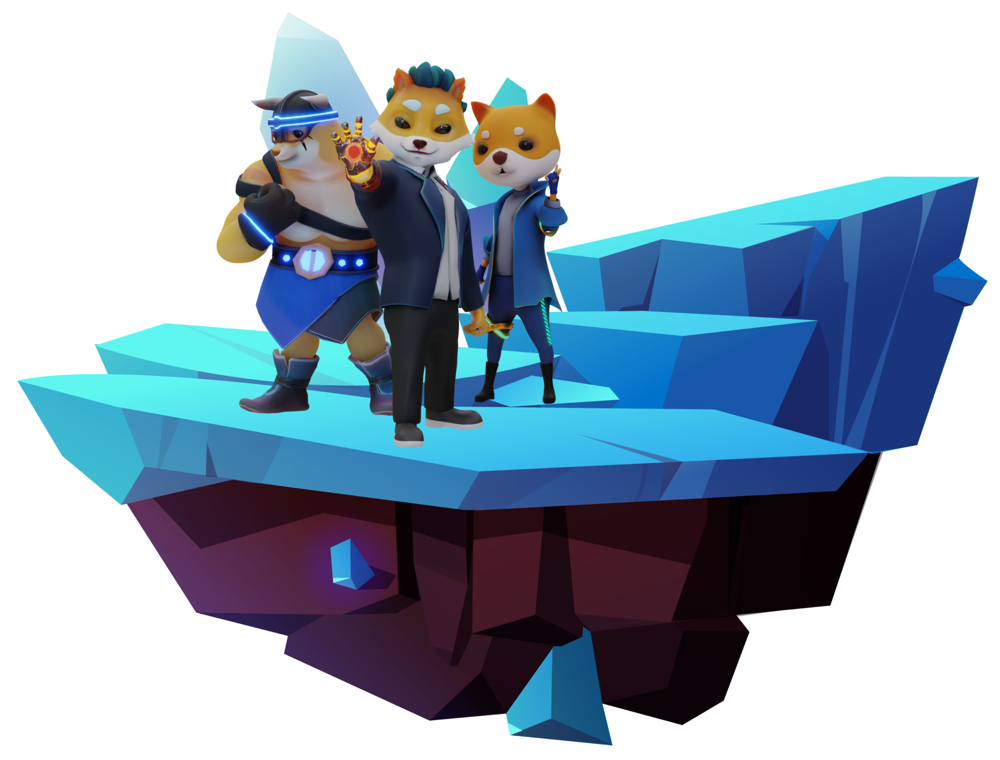

# Clash Of Memes

<figure><figcaption></figcaption></figure>

## Game Overview

Clash of Memes is a real-time strategy game inspired by Clash Royale. This game delivers AAA-quality graphics and cutting-edge features and allows players to collect and upgrade cards featuring meme-themed characters and abilities, as well as spells and towers to defend their base&#x20;

* Category: NFT (Non-fungible token), P\&E&#x20;
* Genre: Action Strategy
* Age: 9+&#x20;
* Platform: Android, iOS
* Launch Date: Q4 - 2023

<figure><figcaption></figcaption></figure>

Inspired by the gripping gameplay of Clash Royale, Clash Of Memes brings game players the most immersive experience in the NFT gaming world.

In the game, players can build their strong combat troops and fight against other players or the system in battles of different modes through the matchmaking system to gather resources for leveling up power, climb to the top of the leaderboard.&#x20;

At the same time, there are numerous opportunities for players to gain an attractive income from the game by:&#x20;

* Participating in in-game activities.
* Competing in PvP battles to win leaderboard prizes.&#x20;
* Collecting and speculating on Meme coins and items.&#x20;
* Opening Mysterious Chests and selling them on the marketplace.

##
