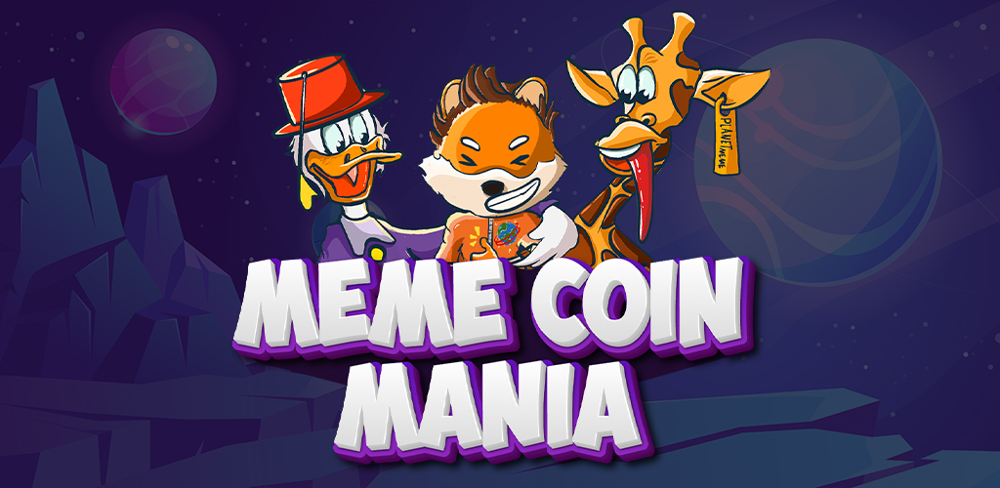
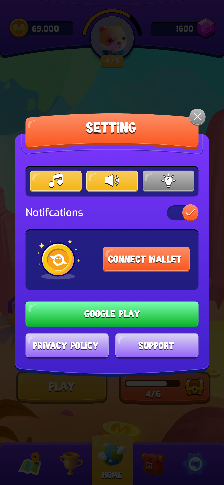

# Meme Coin Mania

<figure><figcaption></figcaption></figure>

Welcome to Meme Coin Mania, an exciting web3 match 3 game developed by Planet Memes Studio. Immerse yourself in a captivating cosmic adventure, where space elements, addictive gameplay, and unique meme coin characters combine to create an unparalleled gaming experience. Prepare to embark on a journey through the cosmos, earn real rewards, and connect with a vibrant community of players.

## Game Concept

* Cosmic Adventure Theme: Explore a visually stunning space-themed world, filled with vibrant colors, celestial bodies, and captivating cosmic elements. Traverse different planets, navigate asteroid fields, and unlock celestial treasures as you progress.

<figure><figcaption></figcaption></figure>

### Engaging Match 3 Mechanics:

* Solve Challenging Puzzles: Put your matching skills to the test in exciting and challenging puzzles. Strategically swap and match cosmic elements to create powerful combos and clear levels. The more matches you make, the higher your score.

<figure><figcaption></figcaption></figure>

### Unique Space Elements:

* Discover Rockets and Moons: Uncover rocket boosters and lunar artifacts throughout your cosmic journey. Utilize these special space-themed elements strategically to enhance your gameplay, unlock bonuses, and earn rewards.
* Unearth Books and Astronaut Gloves: Encounter ancient tomes and astronaut gear as you progress. Collect these valuable items and utilize them strategically to unlock hidden secrets, gain powerful abilities, and progress further in the game.

<figure><figcaption></figcaption></figure>

### Meme Coin Characters:

* Play as Iconic Meme Coin Characters: Dive into the world of meme coins with unique and lovable characters inspired by popular cryptocurrencies like Dogecoin, Pepe, Shiba Inu, and more. Each character brings its own personality, special abilities, and charm to the game, making your cosmic adventure even more enjoyable.

<figure><figcaption>
Doge Elon
</figcaption></figure>

* PFP NFTs: Own and collect exclusive PFP NFTs of the meme coin characters. These limited-edition NFTs serve as a representation of your in-game avatar and can be used both within the game and as a status symbol in the wider NFT community.

### Web3 Integration:

* Seamless Connectivity: Connect effortlessly to the game using Web3Auth wallet integration. Enjoy a smooth and secure gaming experience with easy authentication and access to blockchain-based functionalities.
* Non-Custodial Wallet Solutions: Embrace true ownership and control over your in-game assets. Utilize non-custodial wallet solutions to securely store and manage your cosmic treasures.
* Simple Authentication: Experience a hassle-free login process through popular social media platforms like Google Play, Apple, and Discord. Seamlessly connect and enjoy the game across multiple devices.

<figure><figcaption></figcaption></figure>

### Real Rewards:

* Earn PMC (Planet Memes Coin): Engage in exhilarating gameplay, achieve high scores, and complete challenges to earn PMC, the native digital currency of Planet Memes Studio. Accumulate PMC to unlock exclusive in-game bonuses, cosmic artifacts, and other valuable rewards.
* Leaderboards and Tournaments: Compete against other players, climb the leaderboard, and showcase your match 3 skills. Participate in tournaments to earn even more rewards and recognition for your achievements.

### Community and Social Interaction:

* Vibrant Community: Join a passionate community of space explorers, meme enthusiasts, and gaming aficionados. Connect, interact, and engage with like-minded individuals who share a common love for the cosmic world.
* In-Game Chat and Social Media Integration: Communicate with fellow players, share your experiences, and stay updated on the latest game developments. Seamlessly integrate with popular social media platforms to connect and collaborate with the community.

### Conclusion:&#x20;

Meme Coin Mania is a thrilling web3 match 3 game that combines the excitement of cosmic adventures, addictive gameplay, real rewards, and meme coin characters

<figure><figcaption></figcaption></figure>

 

<figure><figcaption></figcaption></figure>

 

<figure><figcaption></figcaption></figure>

 

<figure><figcaption></figcaption></figure>

 

<figure><figcaption></figcaption></figure>

\
