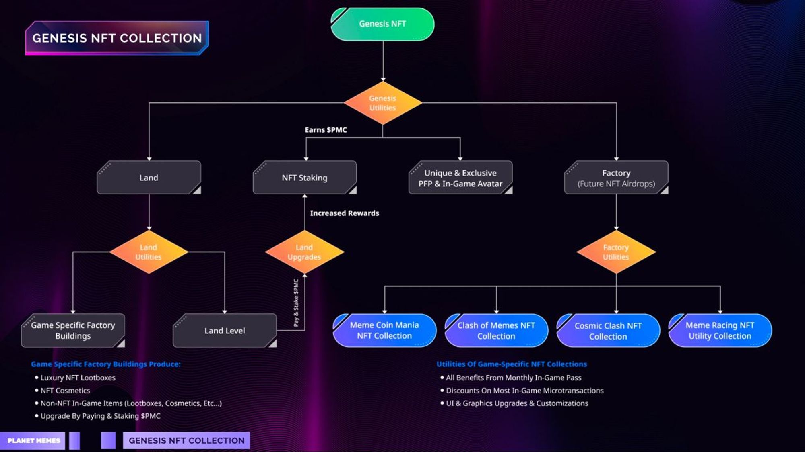

# Planet Memes Economy & NFTs

**NFT ECOSYSTEM**

Planet Memes features a carefully curated NFT ecosystem that offers unique and exclusive rewards for players. The ecosystem includes a variety of NFT collections that can be earned through gameplay, staking $PMC, and acquiring Genesis NFTs. These NFTs offer a range of benefits, including access to exclusive games and experiences, microtransaction discounts, in-game UI upgrades, and cosmetic-only rewards. To prevent competition between the company and secondary markets, all in-game items that are purchasable via microtransactions and unlimited in quantity will not be NFTs. With this approach, Planet Memes is able to offer a diverse and exciting NFT ecosystem for players to explore and engage with.\

## Genesis NFT Collection

\
Meme coin mania NFTs meme coin mania players will be able to aquire, upgrade and trade unique Non-Fungible Tokens (NFTs) featuring meme coin-themed characters that are directly connected to your favorite meme coins like Dogecoin, Shiba Inu, or PepeCoin. With our innovative MemeNFT Reserve Model, we're taking this concept to new heights!

<figure><figcaption></figcaption></figure>

### Genesis NFT Collection Breakdown

1. The OG NFT is an exclusive NFT collection that provides access to the full range of Planet Memes games and experiences. It serves as a PFP, factory NFT, and land NFT all in one.
2. The Factory NFT aspect of the OG NFT serves as a gateway to the game-specific NFT collections (1 per game), which will be airdropped to the OG NFT holders upon release and can be resold.
3. The airdropped game-specific NFTs will include all benefits from the monthly in-game pass, offer microtransaction discounts, and numerous in-game UI upgrades, and more.
4. The Land part of this NFT acts as a hub for the game-specific factory buildings, tournament hosting, and produces $PMC, which is distributed to OG NFT holders.
5. The Land NFT in the OG NFT Collection has four game-specific buildings that produce in-game assets such as luxury NFT lootboxes, cosmetics, and other items. These buildings can be upgraded using $PMC staking and fees to increase production output.
6. Genesis NFT holders can host tournaments on their land and earn a share of the entry fees.
7. OG NFT holders can stake their NFTs to receive staking rewards in $PMC, which are sourced from overall microtransactions in the Planet Memes ecosystem. The Land can also be upgraded by staking $PMC with a fee for a larger portion of $PMC rewards.

### Planet Memes Game Specific NFTs

Game-specific NFTs are a key part of the Planet Memes NFT ecosystem, offering unique benefits to players. These NFTs provide all the benefits of the monthly in-game pass, as well as exclusive discounts on microtransactions and a range of in-game UI upgrades. By owning these NFTs, players are given a distinct advantage within the game, as well as the opportunity to collect and trade rare, game-specific NFTs on the secondary market. This incentivizes players to invest in the Planet Memes ecosystem and adds a new layer of excitement and value to the game.

### Other NFTs

Aside from the Genesis NFT Collection and game-specific NFTs, Planet Memes will also offer multiple collections of exclusive cosmetic-only NFTs. These NFTs will allow players to customize their avatars, weapons, and other in-game assets with unique and rare designs. The designs will be curated by the Planet Memes team and will be available in limited quantities, making them highly desirable among players. As the game and ecosystem continue to develop, other types of NFTs may emerge, providing players with even more opportunities to engage with the game and earn unique rewards.

\

### Here's how it works in simple terms: 

**Step 1:** Purchase an NFT: Select and acquire an NFT of your choice, such as the "KingDoge" representing a captivating virtual skin for your game avatar.

**Step 2:** Value Backed by Meme Coins: A percentage of your NFT purchase (50%) is used to buy and reserve meme coins, specifically tied to the meme coin represented by your chosen NFT. in this case Dogecoin.\
\
**Step 3:** Building Reserves: The purchased Dogecoins are securely locked within a reserve pool that directly connects to your "KingDoge" NFT. This means your NFT now holds real value, backed by a reserve of Dogecoin tokens.\
\
**Step 4:** In-Game Possibilities: Enjoy exciting benefits and unique features within the game using your "KingDoge" NFT. Unleash special powers, gain exclusive abilities, or enhance your overall gaming experience in extraordinary ways!\
\
**Step 5:** Flexibility and Control: Should you decide to part ways with your "KingDoge" NFT, you have options. You can sell it on a dedicated marketplace to another avid collector, or you can choose to burn it instantly. Burning the NFT grants you access to the reserved Dogecoins, which you can sell or hold at your discretion.
