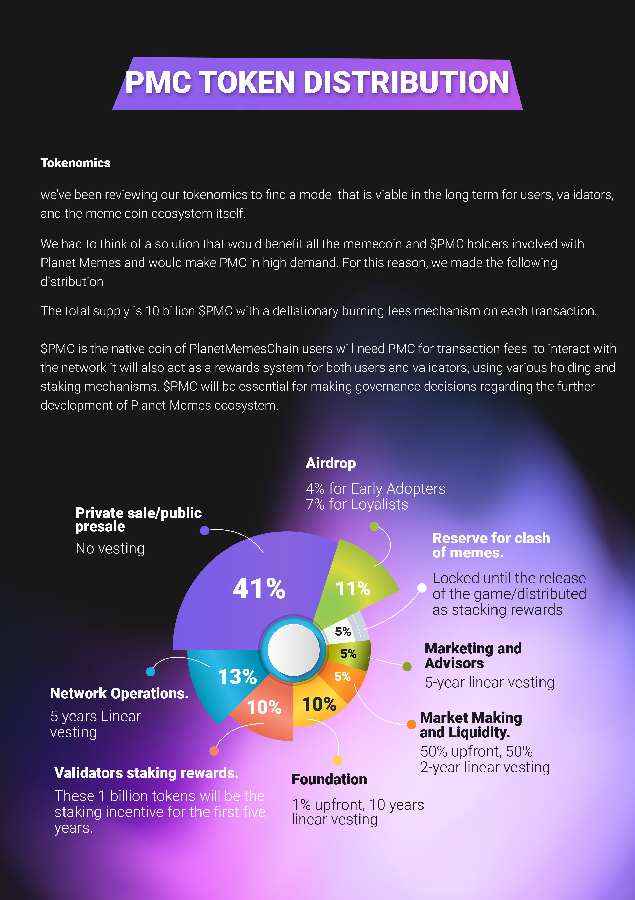

# PMC Tokenomics

`NOTE:`<mark style="color:red;">`Depending on the game and The DAO community votes, holding Meme coins selected by the DAO community is required to get access to planet memes games`</mark>` ```&#x20;

<figure><figcaption></figcaption></figure>

## Token Utility

| **Blockchain transaction fees**      | PMC tokens are used to govern and secure the PMC network and pay transaction fees.                                                                                                                                                                                                    |
| ------------------------------------ | ------------------------------------------------------------------------------------------------------------------------------------------------------------------------------------------------------------------------------------------------------------------------------------- |
| **Validator staking rewards**        | Validators will receive staking rewards for providing computing resources to PMC Network.                                                                                                                                                                                             |
| **Gameplay Payments and Entry Fees** | Players need PMC Tokens to pay items, such as entry fees to all skill-based tournaments in Planet Memes games.                                                                                                                                                                        |
| **Gameplay Rewards**                 | Initial rewards across supported games are paid in PMC, these will be replaced with sponsored rewards (partner tokens)                                                                                                                                                                |
| **NFTs Purchases & Renting**         | Players need PMC to purchase game characters, various in-game items, custom platform avatars, and types of virtual real estate in Planet Memes games. Renting of NFTs (game characters, real estate) will be facilitated in PMC token.                                                |
| **NFTs Upgrades & Breeding**         | Players will use PMC to access and upgrade their in-game characters and increase the heroes' overall power and stats, as well as use PMC tokens to breed new heroes.                                                                                                                  |
| **Marketplace**                      | The marketplace will enable the community to purchase, rent, and trade in-game items in PMC tokens.​Items include game characters (such as clash of memes heroes, and cards), in-game items, and virtual real estates such as clash of memes battlegrounds and LAND and partner NFTs. |
| **Voting**                           | PMC will allow holders to participate in decision-making about the platform features and games roadmap.                                                                                                                                                                               |

\


